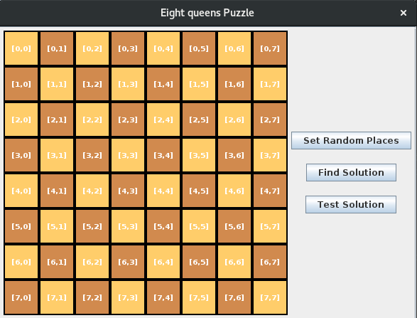
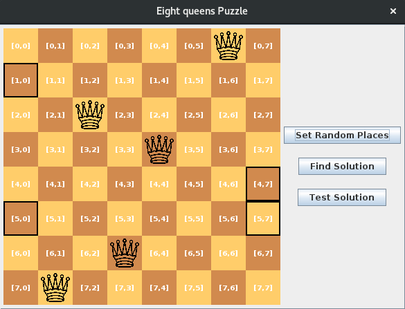
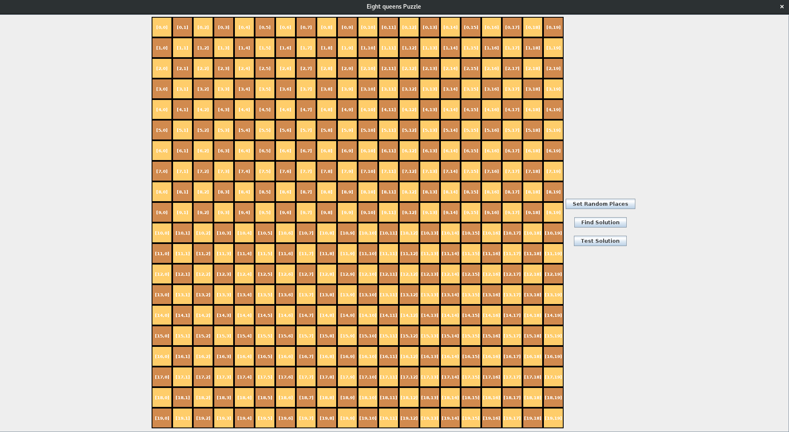
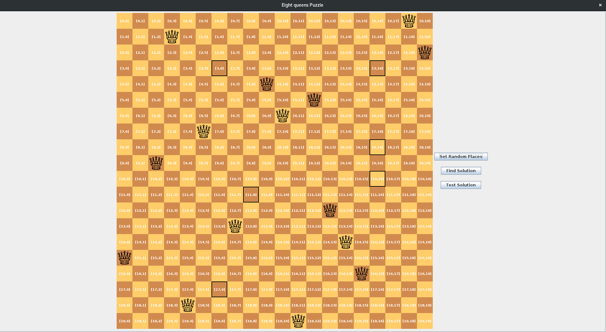

# EightQueensPuzzle
Java, Maven, RandomDataGenerator.

EightQueensPuzzle project is used for dynamical simulation eight queens problem inspired by Clay Mathematics Institute Millennium Problem.
http://www.claymath.org/events/news/8-queens-puzzle
    
Checkout Configuration for dynamically options.
    
    Configuration configuration = new Configuration();
    configuration.setSizeOfCell(50);
    configuration.setSizeOfTable(8);
    configuration.setConsoleApplication(false);
    configuration.setNumberOfQueens(5);
   
Since this is Millennium Problem I didn't find solution. Goal of this project
is to help visualize and test solution by running various random configuration
 through Configuration class.

# Getting Started

Clone or download project. Import project as Maven Project. 
Check out EightQueensPuzzle class, main method and Configuration class.
Run it.

# Eight Queens Puzzle Simulator Screenshots

* Size of board = 8, number of queens = 5.

* Size of board = 8, number of queens = 5.

* Size of board = 20, number of queens = 15.

* Size of board = 20, number of queens = 15.
