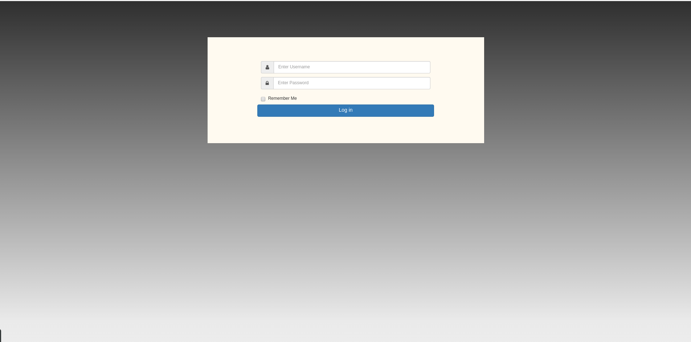
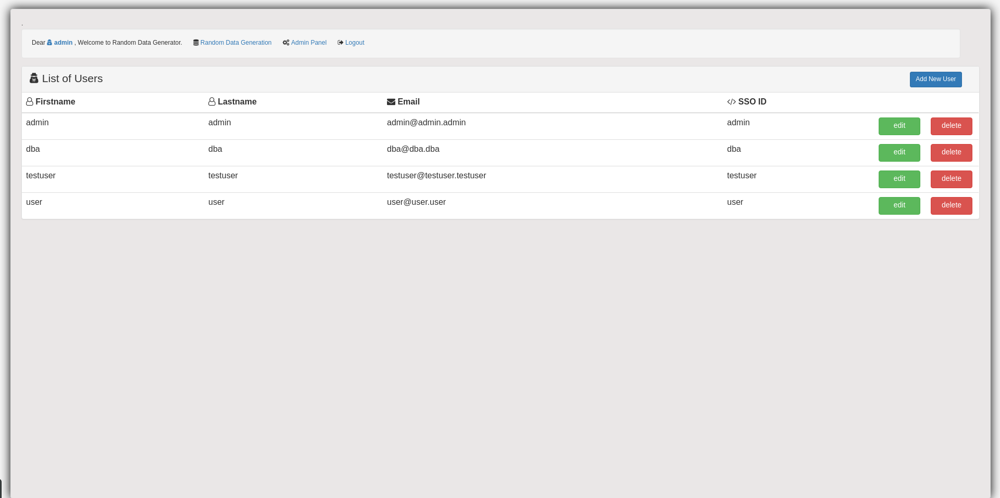
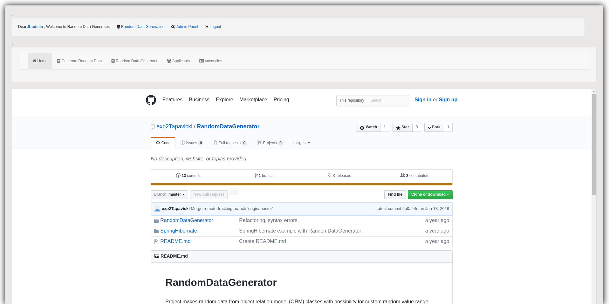
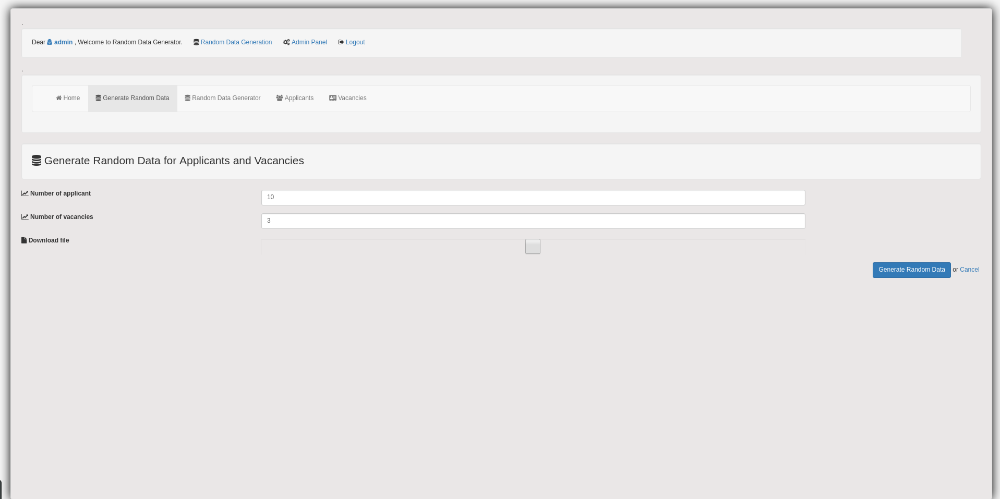
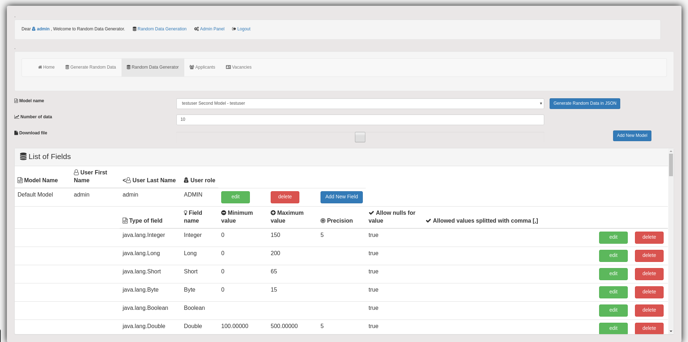
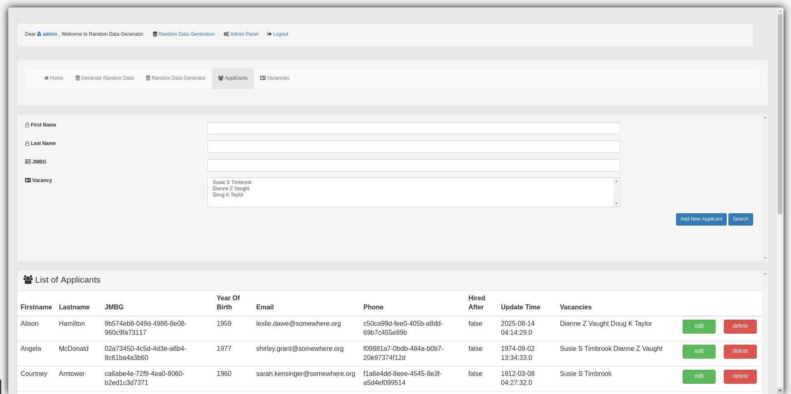
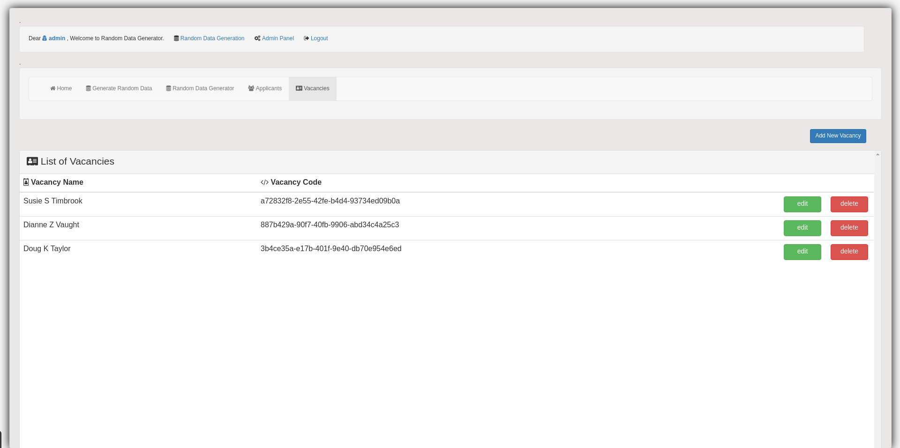
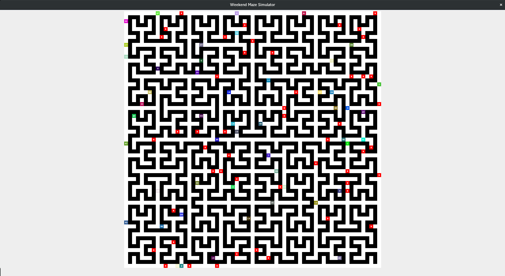
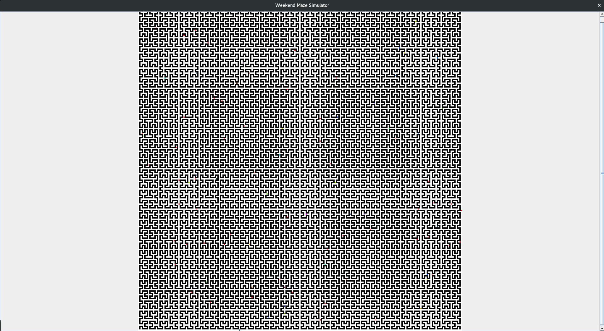

# RandomDataGenerator
Project makes random data from object relation model (ORM) classes with possibility for custom random value range,
filtering and sorting data. Exporting data to some type of file or jasper report. Way to show generated data. It is 
really useful when you need to test something and you need specific random field values from some object. You 
don't need to create data in database. All you need to do is to take class from witch you need data and setup specific 
range for property random values. For example there is possibility to fill empty database with random data generated 
from this project.

Check out TestDataUtil class for examples how to set up and use it.

To set limit for special property look at boundary.properties file. Without this settings always will be used maximum
or minimum value for given type.

There is some example of usage of this project in project SpringHibernate check it out.

# SpringHibernate
Spring, Hibernate, Bootstrap, Maven, JSP, MySql, RandomDataGenerator.

Example of spring, hibernate with random data generation.

RandomDataGenerator project is added for generating random data, exporting. Scope of web application is defined with 3 roles (ADMIN, DBA, USER).
Every role has different permissions in application. Spring Security is implemented with remember me functionality. Goal of project is to every user have they models definitions from witch they can easily generate specified number of random data. Purpose of this is when you want to test something and you need a lot of data for that. You can easily add properties and value bounds to model and generate data. At the moment there is only json support. You can either download json file or on success page copy data. File generation is in memory so I don't suggest to generate a lot of data if you don't have enough memory. I don't need to write files on system but it will be added as functionality later I think because of optimization. Also if you need random data generation from ORM classes it is better just to use RandomDataGenerator project. There is example how to generate data. Some ORM relation cases are not covered.

# Getting Started

Requirements: 
* MySQL server(mine is 5.7)
* Apache Tomcat(mine is 8.5)
* Maven(mine is 3.3.9)

Clone or download project. Install MySQL server(mine is 5.7) and import database from createDB.sql in SQLScript folder.

Download and setup Apache Tomcat within workspace IDE. Import project as Maven Project.

Set database connection settings in applicaton.properties.

There is some app_user inserted already. For everyone password is 'asdasd'. Explore the web application.

# Web Application Screenshots

* Login page

* Admin panel

* Random Data Generation home page

* Generate Random Data for Applicants and Vacancies page

* Generate Random Data from model page

* Applicants page

* Vacancies page

# WeekendMazeSimulator
Java, Maven, RandomDataGenerator.

WeekendMazeSimulator project is used for dynamical simulation/generation of Hibert Maze with players and food energy. 
It is a simulator for machine learning. Goal is to have different machine learning models whose purpose is to evaluation and testing for this specific dynamic cases. 
Game goal is for every player to survive as long as possible.
    
Everything is dynamically configurable through Configuration class.
    
    Configuration configuration = new Configuration();
    configuration.setNumberOfFood(50);
    configuration.setFoodEnergy(100);
    configuration.setNumberOfPlayers(50);
    configuration.setPlayersEnergy(100);
    configuration.setSizeOfMaze(5);
    configuration.setSizeOfCell(15);
    configuration.setSleepTime(500);
    configuration.setAiLogicTypes(AILogicTypes.RANDOM);
    configuration.setNumberOfEpoch(6);

At the moment I didn't found out suitable model to apply. 
Limits for everything is resources you have(Processor and memory).
It would be good to increase Heap Space for the VM with -Xms and -Xmx. Like in example.
 
-Xms1g -Xmx8g 

# Getting Started

Clone or download project. Import project as Maven Project. 
Check out WeekendMazeSimulator class, main method and Configuration.
Run it.

# Weekend Maze Simulator Screenshots

* Size of maze 5, cell size 15.

* Size of maze 7, cell size 4.

# Video
https://youtu.be/Sz74KC70j1o
