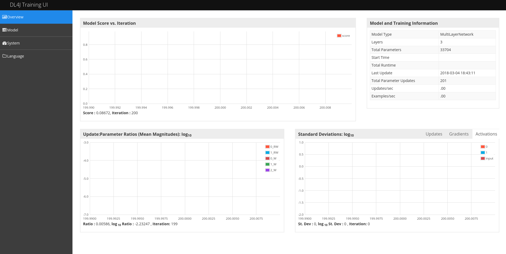

# WeekendMazeSimulator
Java, Maven, RandomDataGenerator.

WeekendMazeSimulator project is used for dynamical simulation/generation of Hibert Maze with players and food energy. 
It is a simulator for machine learning. Goal is to have different machine learning models whose purpose is to evaluation and testing for this specific dynamic cases. 
Game goal is for every player to survive as long as possible.
    
Everything is dynamically configurable through Configuration class.
    
    Configuration configuration = new Configuration();
    configuration.setNumberOfFood(5);
    configuration.setFoodEnergy(100);
    configuration.setNumberOfPlayers(5);
    configuration.setPlayersEnergy(100);
    configuration.setSizeOfMaze(3);
    configuration.setSizeOfCell(15);
    configuration.setSleepTime(500);
    configuration.setAiLogicTypes(AILogicTypes.Random);
    configuration.setNumberOfEpoch(4);
    configuration.setListenerFrequency(200);

At the moment I didn't found out suitable model to apply. 
Limits for everything is resources you have(Processor and memory).
It would be good to increase Heap Space for the VM with -Xms and -Xmx. Like in example.
 
-Xms1g -Xmx8g 

# Getting Started

Clone or download project. Import project as Maven Project. 
Check out WeekendMazeSimulator class, main method and Configuration.
Run it.

After training is started you can go to [here](http://localhost:9000/train/overview)
and check out training progress.

Currently RNN GravesLSTM model have this scores with 4 classes. Notice that I didn't use 
one vs all.
 
---|---:
 Accuracy | 0.8163
 Precision | 0.7070
 Recall | 0.8442
 F1 Score | 0.6873

Precision, recall & F1: macro-averaged (equally weighted avg. of 4 classes)

# Weekend Maze Simulator Screenshots

* Size of maze 5, cell size 15.

* Size of maze 7, cell size 4.

# Video
https://youtu.be/Sz74KC70j1o